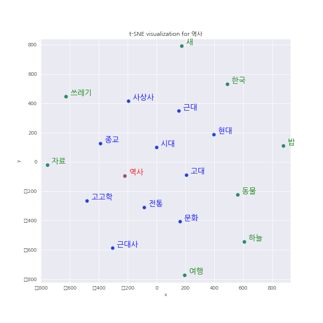
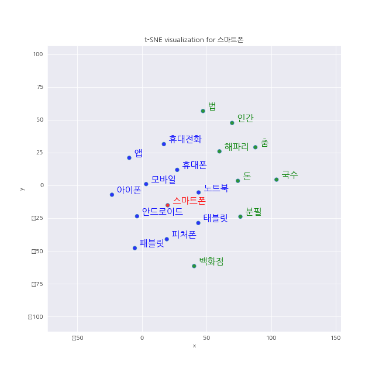

# Korean_word2vec

word2vec in korean

### Prerequisites

```
python3
gensim
konlpy
codecs
matplotlib
seaborn
sklearn
pandas
```
### Installing


한국어 위키 덤프 파일 다운로드

```
wget https://dumps.wikimedia.org/kowiki/20190301/kowiki-20190301-pages-articles.xml.bz2
```

위키피디아 덤프 파일 파싱

```
git clone "https://github.com/attardi/wikiextractor.git"
python WikiExtractor.py kowiki-20190301-pages-articles.xml.bz2 
```
https://wikidocs.net/22660 참고해서 하나의 txt 파일로 구성

## Training

텍스트를 Okt를 이용해 토큰화해서 (토큰화가 2시간 넘게 걸림) Gensim 라이브러리 이용해서 embedding 후 학습.

```
python train_w2v.py --dataset "txt 파일위치"
```
3개의 모형 저장 파일이 생기는데 삭제하면 안 됨.

### 임베딩 결과
```
print(embedding.wv.most_similar(positive=["공포"]))
print(embedding.wv.most_similar(positive=["동물"]))
print(embedding.wv.most_similar(positive=["통계"]))

#[('제정', 0.4467240869998932), ('두려움', 0.4429143965244293), ('혐오', 0.4345221519470215), ('불안감', 0.4040243923664093), ('栱包', 0.402253657579422), ('증오', 0.38317736983299255), ('분노', 0.3810647130012512), ('스릴러', 0.3755665123462677), ('질린다', 0.3750323951244354), ('치안유지법', 0.3747129440307617)]
#[('생물', 0.7137835621833801), ('곤충', 0.6817206144332886), ('짐승', 0.6774595379829407), ('식물', 0.6387141942977905), ('포유류', 0.626631498336792), ('포유동물', 0.6182601451873779), ('물고기', 0.610832929611206), ('동식물', 0.609168529510498), ('척추동물', 0.6020264625549316), ('인간', 0.5923241376876831)]
#[('통계학', 0.5518889427185059), ('분석', 0.5027167797088623), ('자료', 0.4961372911930084), ('수치', 0.48129206895828247), ('센서스', 0.47838157415390015), ('정보', 0.4725317060947418), ('메타분석', 0.4574437737464905), ('조사', 0.4519674777984619), ('연구', 0.44756704568862915), ('기준', 0.44388657808303833)]
```
```
print(embedding.wv.similarity('강아지', '귀엽다'))
print(embedding.wv.doesnt_match(['강아지', '고양이', '나무', '노래'])) #가장 다른 것 하나를 제외
#0.25804687
#노래
```
```
print(embedding.wv.most_similar(positive=['러시아', '오바마'], negative=['미국'], topn=3))
print(embedding.wv.most_similar(positive=['중국', '도쿄'], negative=['일본'], topn=3))
print(embedding.wv.most_similar(positive=['대한민국', '워싱턴'], negative=['미국'], topn=3))
print(embedding.wv.most_similar(positive=['물리학', '기술'], negative=['기초'], topn=3))
#[('푸틴', 0.520085334777832), ('메드베데프', 0.4510819613933563), ('알렉산드르', 0.4427488148212433)]
#[('상하이', 0.5591546297073364), ('베이징', 0.5507391691207886), ('톈진', 0.5008012652397156)]
#[('서울특별시', 0.43822532892227173), ('서울', 0.4104611277580261), ('수원시', 0.3880981206893921)]
#[('전자공학', 0.5131317377090454), ('유체역학', 0.5029642581939697), ('전산학', 0.5004225969314575)]
```
```
print(embedding.wv.most_similar(positive=['왕', '여자'], negative=['남자'], topn=3))
[('국왕', 0.5742357969284058), ('군주', 0.540992021560669), ('왕인', 0.5139432549476624)]
#여자와 여왕간의 거리가 멀어서 기대한 여왕이 나오지 않음.
```


### t-sne 그림
```
python t_sne.py --model "path of the model" --word 키워드 --list 임의 선택 단어 들 --embedding 저장한_임베딩_
```
matplotlib에서 한글 font 문제가 있는데, 우분투에서만 해결한 상태.



